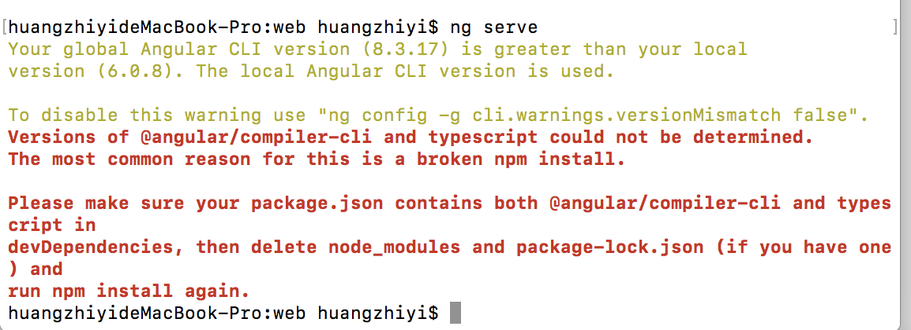

# 19fall_GQP_MassDEP

TO-DO: Project description.

## Data Processing and Exploration

File Conversion
- Make sure pdf_to_txt.py and batch_pdf_to_txt.py are in the same directory with the folder containing pdf files.
- Run batch_pdf_to_txt.py for folder to folder processing.

Parsing
- 1_dataprocess_elements.ipynb
- file_parser.py
- parser_alex.py

Cleaning
- deep_clean.py
- ...

Combining
- ...

Exploratory Data Analysis
- ...

## Getting Started with the Web Application

### Prerequisites

- Elasticsearch installation.
https://www.elastic.co/guide/en/elasticsearch/reference/current/install-elasticsearch.html

MacOS:
We recomend install Elasticsearch with the Homebrew package manager.

i) write 
` brew install elastic/tap/elasticsearch-full ` 
from the command line.


ii) run 
    `cd /usr/local/etc/elasticsearch
       open elasticsearch.yml
    ` 
    in the command line
    
    
iii)paste
    `http.cors.enabled : true
       http.cors.allow-origin : "*"
       http.cors.allow-methods : OPTIONS, HEAD, GET, POST, PUT, DELETE
       http.cors.allow-headers : X-Requested-With, X-Auth-Token,Content-Type, Content-Length
    `
    at the end of the file
    
    
    
- Elasticsearch-browser installation.
Elasticsearch-browser is needed for the front-end. MacOS:
```
npm install elasticsearch-browser
```

- Download the elasticsearch package for python.
Run `pip install elasticsearch` from the command line.
If you have more than one python version, make sure the package install in the version you used in Pycharm. 

### Installing

1. Download the 19fall-GQP repository.

2. Start Elasticsearch.
Run `elasticsearch` from the command line.

3. CSV files are included in the `/data` folder. To import data into Elasticsearch, first make sure Elasticsearch is connected, then run 
```
/src/es-load.py
```
Once you run the code successful, you will see the pics below.


4. Install dependencies, go to `/web` and run
```
npm install
```
It is very common to see some warn in the command line.


5. To start the web app, under `/web` run `ng serve`.


i)
Fix: run `sudo npm install -g @angular/cli@latest` in the command line
     then run `ng serve` in the command line

ii)
Fix: open the "package.json" file
     change "@angular/compiler-cli",like the below screenshot
     
     then run ` npm install` and `ng serve` in the command line
     

iii)
Fix: open the "package.json" file
     change "rxjs" and "TypeScript" verstion like below screenshot
     
     Next go to your project folder and delete "node_modules" folder.
     After delete, next run `npm install` in the command line
     Finally run `ng serve`

6. Navigate to `http://localhost:4200/`.Test the project.


7. Stop the elasticsearch.
"Control + C "in both two command line.

## Built With
This project was generated with [Angular CLI](https://github.com/angular/angular-cli) version 6.0.3.


## Authors


## License


## Acknowledgments

