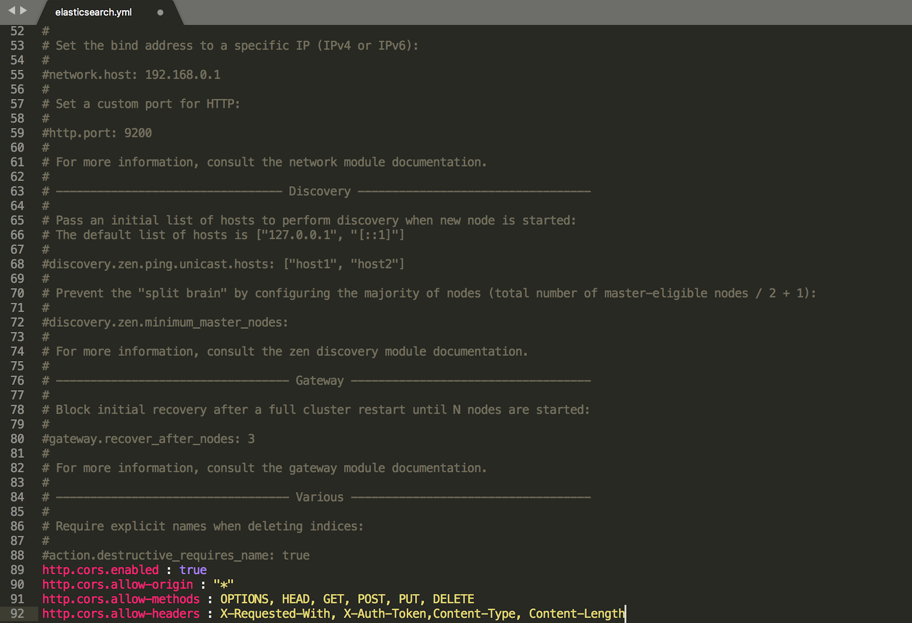
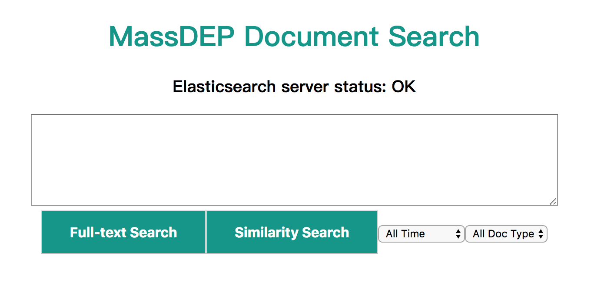
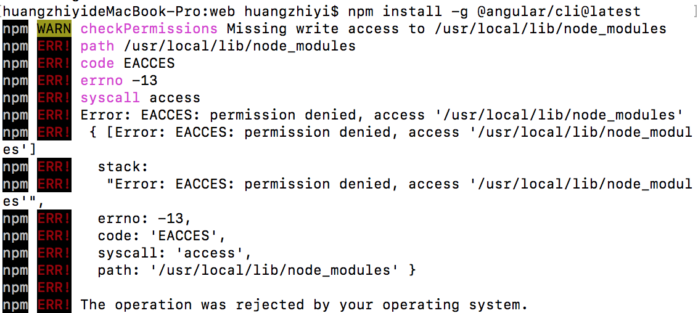
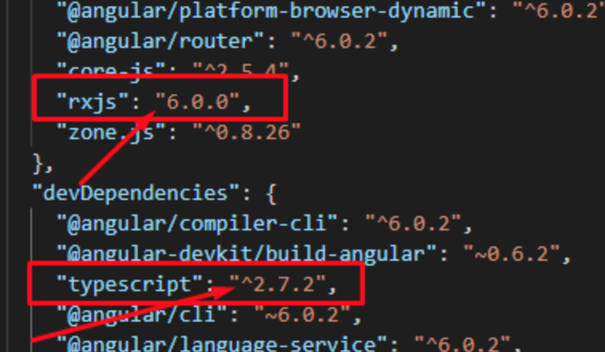

# 19fall_GQP_MassDEP

## Project Description
To facilitate the transition of useful information to a younger workforce, 
MassDEP is looking for an innovative knowledge transfer mechanism that can 
inform younger employees of the relevant citations 
(an alphanumeric categorization MassDEP uses to identify a specific violation)
when faced with a circumstance 
(the situation which resulted in the code violation being identified) 
by providing similar enforcement documents from the past. 

This project includes the following goals:
- Extract document elements: citations and circumstance.
- Correlate citations to descriptions of violation circumstances.
- Enable full-text search and similarity search, 
given key word(s), phrases, and paragraphs describing a circumstance.
- Build a user-friendly document search engine. 

## Data Processing and Exploration

File Conversion
- Make sure pdf_to_txt.py and batch_pdf_to_txt.py are in the same directory with the folder containing pdf files.
- Run batch_pdf_to_txt.py for folder to folder processing.

Parsing
- 1_dataprocess_elements.ipynb
- file_parser.py
- parser_alex.py

Cleaning
- deep_clean.py

Exploratory Data Analysis
- 1basic_statistics.ipynb
- 2sentimental_analysis.ipynb

## Getting Started with the Web Application

### Prerequisites

- Elasticsearch installation.
https://www.elastic.co/guide/en/elasticsearch/reference/current/install-elasticsearch.html

  MacOS:
  We recommend install Elasticsearch with the Homebrew package manager.

  i) Run the following code from the command line. 
  ``` 
  brew tap elastic/tap
  brew install elastic/tap/elasticsearch-full
  ```
  
  ii) Run the following code from the command line to change Elasticsearch configuration.
  ```
  cd /usr/local/etc/elasticsearch
  open elasticsearch.yml  
  ```  
  
  iii) Paste the following code to the end of the yml file.
  ```
  http.cors.enabled : true
  http.cors.allow-origin : "*"
  http.cors.allow-methods : OPTIONS, HEAD, GET, POST, PUT, DELETE
  http.cors.allow-headers : X-Requested-With, X-Auth-Token,Content-Type, Content-Length
  ```
  
    
- Elasticsearch-browser installation.
Elasticsearch-browser is needed for the front-end. MacOS:
  ```
  npm install elasticsearch-browser
  ```

- Install the Elasticsearch Python client.
Run the following code from the command line.
If you have more than one python version, make sure the package install in the version you used in Pycharm. 
  ```
  pip install elasticsearch
  ```

- Install npm and Node.js.
https://docs.npmjs.com/downloading-and-installing-node-js-and-npm

- Install the Angular CLI
  ```
  npm install -g @angular/cli
  ```

### Installing

1. Download the 19fall-GQP repository.

2. Start Elasticsearch.
Run `elasticsearch` from the command line.

3. CSV files are included in the `/data` folder. 
To import data into Elasticsearch, first make sure Elasticsearch is connected, then run 
   ```
   /src/es-load.py
   ```
   Once you run the code successfully, you will see the pics below.
   

4. Install dependencies. Go to `/web` and run
   ```
   npm install
   ```
   It is very common to see warnings and errors during step 4. We include some examples in the troubleshooting section.

5. To start the web app, under `/web` run 
   ```
   ng serve
   ```
   The compilation may take a while, if it is successful, you will see:
   

   It is also very common to see warnings and errors during step 5. We include some examples in the troubleshooting section.

6. Navigate to `http://localhost:4200/`. You will see
   

7. Stop Elasticsearch and the Web App. Press `Control` + `C` in both command line windows.


### Troubleshooting

- Scenario 1


Fix: Run the following code from the command line. 
```
sudo npm install -g @angular/cli@latest
``` 
Then run `ng serve` in the command line.


- Scenario 2


Fix: Open the `package.json` file under /web and 
     change "@angular/compiler-cli" version as shown in the below screenshot.
     

Then run ` npm install` and `ng serve` in the command line


- Scenario 3


Fix: open the `package.json` file and
     change `rxjs` and `TypeScript` version like the below screenshot
     
     
Next, go to the project folder and delete the `node_modules` folder.
After the deletion, run `npm install` and `ng serve` in the command line

## Built With
This project was generated with [Angular CLI](https://github.com/angular/angular-cli) version 6.0.3.

## Authors
- Alex (ilovemanu)
- Zenia (ZeniaHuang)
- Achu (ekshej)
- Henry (henryji96)

## License

## Acknowledgments

